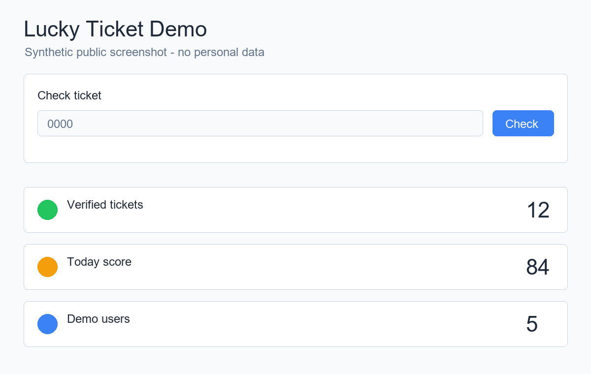
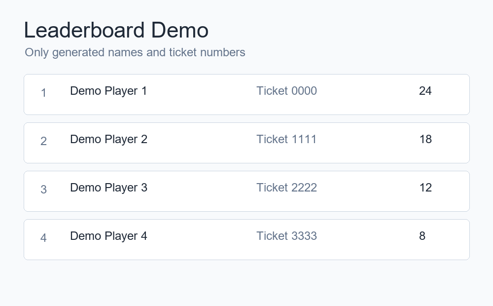
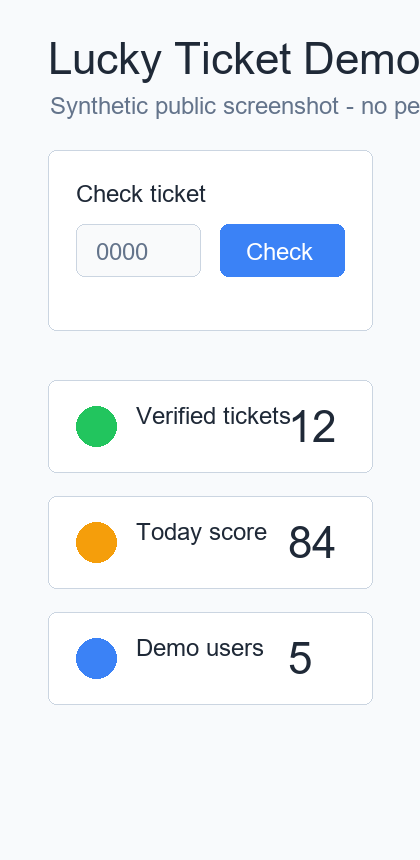

# счастливый билетик

Веб-сервис и боты для игры с билетами общественного транспорта: загрузил билет, система распознала номер, посчитала "счастливость", проверила официальный фискальный чек и добавила результат в профиль, графики и глобальный топ.

**Сайт:** https://счастливыйбилетик.рф

## Скриншоты







## Что умеет

- быстрая проверка последних 4 цифр билета без регистрации;
- загрузка PDF или фото билета в личный профиль;
- OCR и парсинг билетов ЕКАРТА/Гортранс и электронных билетов НСПК;
- детерминированный подсчет счастливости билета;
- проверка фискальных чеков через официальный endpoint ЕКАРТА;
- дневные и почасовые графики поездок;
- глобальный топ только по проверенным билетам;
- Telegram и VK боты для загрузки билетов и уведомлений.

## Стек

- Backend: Python, FastAPI, SQLAlchemy, PostgreSQL/SQLite.
- Frontend: React, Vite, TypeScript.
- Bots: Telegram Bot API и VK Callback API.
- OCR/parsing: `pypdf`, `pillow`, `pytesseract`, `zxing-cpp`.
- Deploy: Docker, nginx, PowerShell deploy script.

## Локальный запуск

```powershell
Copy-Item .env.example .env
python -m pip install -e ".[dev]"
python -m uvicorn app.main:app --app-dir backend --reload
```

В отдельном окне:

```powershell
cd apps/web
npm.cmd install
npm.cmd run dev
```

После запуска:

- API: http://127.0.0.1:8000/api/health
- Web: http://127.0.0.1:5173

## Проверки

```powershell
python -m pytest backend/tests -q
python -m ruff check backend
cd apps/web
npm.cmd run build
```

## Конфигурация

Пример переменных лежит в `.env.example`. Секреты, локальная база, реальные билеты, `deploy.txt` и тестовые артефакты закрыты в `.gitignore` и не должны попадать в публичный репозиторий.

## Документация

- [Product notes](docs/product.md)
- [Architecture](docs/architecture.md)
- [Happiness rules](docs/happiness-rules.md)
- [Fiscal integrations](docs/fiscal-integrations.md)
- [Fiscal check providers](docs/fiscal-check-providers.md)
